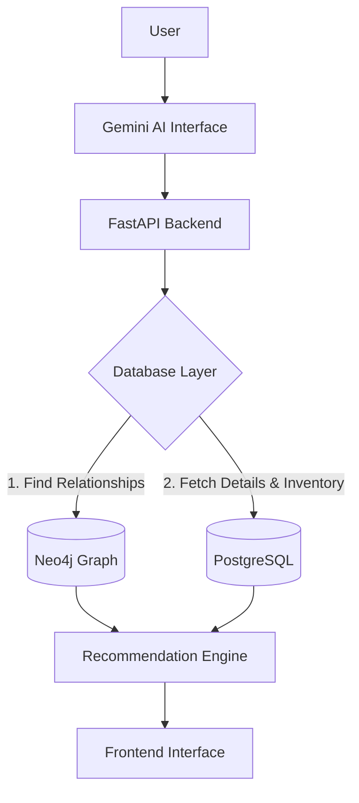

# Database & Neo4j Implementation Guide

Welcome to the **Commerce Intelligence Network (CIN)** implementation guide. This document is a complete technical guide for configuring, seeding, and exposing the dual-database architecture (PostgreSQL and Neo4j) for the project.

---

## SECTION 1: PROJECT OVERVIEW

The **Commerce Intelligence Network (CIN)** is an advanced product curation and recommendation platform. It is designed to intelligently bundle and recommend e-commerce products based on user "Missions" (e.g., *Hostel Setup*, *Gym*, *Travel Essentials*) rather than static categories.

To support high-performance relational queries and complex recommendation traversal, the system utilizes a dual-database architecture:
* **PostgreSQL:** Acts as the absolute Source of Truth. It stores all transactional facts, schemas, deep product metadata (JSONB), and inventory constraints.
* **Neo4j:** Acts as the Recommendation Engine Graph. It is an index of relationships used to quickly traverse connections (e.g., finding products similar to what a user bought, or mapping products to a specific mission). 

### Architecture Flow



---

## SECTION 2: RESPONSIBILITIES

The coexistence of these two databases requires strict boundary management. Data should not be needlessly duplicated.

### PostgreSQL Responsibilities (The Facts)
* **Source of Truth:** Master records for all entities.
* **Complex Data:** Stores specifications in `JSONB`, long text descriptions, prices, quality scores, and review counts.
* **Transactional State:** Inventory, stock status, and system events.

### Neo4j Responsibilities (The Relationships)
* **Graph Traversal:** High-speed network traversal across nodes (Missions → Bundles → Products).
* **Metadata-Light Nodes:** Nodes should only store structural identifiers (UUIDs, names). 
* **NEVER Store in Neo4j:** Do not store deep JSON specifications, huge text descriptions, rapidly changing stock levels, or exact pricing. (Fetch these from PostgreSQL using the UUID).

---

## SECTION 3: FILES PROVIDED

The following curated datasets are provided in the `/datasets` directory. All data is standardized, cleansed, and verified.

* **`products_final_150.csv`**: The curated master catalog containing 150 perfectly balanced products with their deep metadata (`review_count`, `specifications` as JSON, `quality_score`).
* **`inventory.csv`**: Current stock levels (`stock_count`, `status`) tied to product UUIDs.
* **`category_mapping.csv`**: Canonical list mapping all available categories and brands.
* **`similar_products.csv`**: Similarity relationships linking products to one another with a similarity score.
* **`mission_bundles.csv`**: Pre-packaged curated collections of products tailored for specific missions with priority tiers.
* **`ProductMissionMapping.csv`**: Direct mapping edges connecting individual products to their relevant lifestyle missions with confidence scores.
* **`events.csv`**: Simulated system-level events (e.g., price drops, stock changes) used for temporal graph analysis.
* **`recommendation_seed.csv`**: Synthetic historical user interaction logs (views, carts, purchases) correlated with specific missions.
* **`product_quality_scores.csv`**: Exhaustive scoring metrics calculated during the curation pipeline (for historical/analytical reference).
* **`master_products.csv`**: The raw, pre-curation unified catalog (for backup/analytical reference, not for direct app import).

---

## SECTION 4: POSTGRESQL IMPORT ORDER

When executing SQL inserts, you must strictly follow this order to satisfy Foreign Key constraints:

1. **Categories** (Creates the base hierarchy)
2. **Products** (References Categories)
3. **Inventory** (References Products)
4. **Similar Products** (References Products)
5. **Events** (References Products)
6. **Mission Bundles** (References Products)
7. **Mission Mapping** (References Products)
8. **Recommendation Seed** (References Products)

**Why this matters:** PostgreSQL enforces referential integrity. Attempting to insert an Inventory row for a Product UUID that does not yet exist in the Products table will cause a constraint violation and crash the pipeline.

---

## SECTION 5: CATEGORY IMPORT

**Objective:** Map raw category strings to strictly defined PostgreSQL UUIDs.

* PostgreSQL generates unique identifiers (`uuid_generate_v4()`).
* During import, you must establish a `Category Name -> UUID` dictionary mapping in memory (or via temporary tables).
* When a product references "Electronics", the script must look up the UUID for "Electronics" and insert that UUID into the `products` table's `category_id` column.

---

## SECTION 6: PRODUCT IMPORT

**Objective:** Insert the core curated 150 products into PostgreSQL.

* **UUID Replacements:** Replace string-based categories and brands with their respective UUIDs.
* **Preserve Data Types:** 
  * Ensure the `specifications` column is inserted as `JSONB`.
  * Ensure `review_count` is inserted as an Integer.
  * Ensure `quality_score` is inserted as a Decimal/Numeric type.

---

## SECTION 7: FOREIGN KEY MAPPING

Every auxiliary dataset (`inventory.csv`, `similar_products.csv`, `events.csv`, `ProductMissionMapping.csv`, `mission_bundles.csv`, `recommendation_seed.csv`) relies on the **Product ID**.

These files already contain PostgreSQL-ready UUIDs generated during the curation pipeline. You simply need to ensure that the schemas for these auxiliary tables map these string UUIDs to PostgreSQL `UUID` column types, acting as strict Foreign Keys to the `products` table.

---

## SECTION 8: NEO4J GRAPH GENERATION

Once PostgreSQL is seeded, use it to generate the Neo4j graph. Neo4j models relationships to power the recommendation engine.

### Create Nodes
* `(:Mission)`
* `(:Category)`
* `(:Product)`
* `(:Brand)`
* `(:Bundle)`
* `(:Event)`

### Create Relationships
* `(:Mission)-[:REQUIRES]->(:Category)`: Connects lifestyle missions to canonical product categories.
* `(:Category)-[:HAS_PRODUCT]->(:Product)`: Links product nodes to their parent categories.
* `(:Product)-[:SIMILAR_TO]->(:Product)`: Undirected (or bi-directional) relationships denoting similarity.
* `(:Mission)-[:HAS_BUNDLE]->(:Bundle)`: Connects missions to curated collections.
* `(:Bundle)-[:CONTAINS]->(:Product)`: Maps individual products inside a bundle.
* `(:Brand)-[:SELLS]->(:Product)`: Maps the brand entity to its portfolio.
* `(:Product)-[:HAS_EVENT]->(:Event)`: Attaches temporal events to products.

---

## SECTION 9: GRAPH GENERATION ORDER

To avoid orphaned relationships or missing nodes, construct the graph in this order:

1. **Categories**
2. **Products**
3. **Brands**
4. **Missions**
5. **Bundles**
6. **Events**
7. **Similar Products** (Relationships)
8. **Mission Relationships** (Relationships)

**Why:** Nodes must exist before edges can be drawn between them. Establishing the foundational nodes (Categories, Products, Brands) allows the subsequent edge-mapping routines to successfully bind relationships.

---

## SECTION 10: POSTGRESQL → NEO4J PIPELINE

The full infrastructure orchestration follows this exact pipeline flow:

```text
[ Read CSV Datasets ]
         ↓
[ Seed PostgreSQL Tables ]
         ↓
[ Query PostgreSQL via Script ]
         ↓
[ Generate Neo4j Nodes ]
         ↓
[ Generate Neo4j Relationships ]
         ↓
[ Execute Graph Validation Queries ]
```

---

## SECTION 11: VERIFICATION

After running your import scripts, use this checklist to certify the environment:

- [ ] ✓ Products imported successfully into PostgreSQL
- [ ] ✓ Categories imported and mapped
- [ ] ✓ Inventory linked to Products
- [ ] ✓ Similar Products linked via Foreign Keys
- [ ] ✓ Events linked via Foreign Keys
- [ ] ✓ Missions linked
- [ ] ✓ Bundles linked
- [ ] ✓ Graph relationships created in Neo4j
- [ ] ✓ No orphan nodes in Neo4j
- [ ] ✓ No orphan relationships in Neo4j

---

## SECTION 12: SAMPLE CYPHER QUERIES

Below are examples of how the backend will interact with Neo4j to retrieve recommendation targets.

**Find all products for a specific Mission (e.g., Hostel Setup):**
```cypher
MATCH (m:Mission {name: "Hostel Setup"})-[:REQUIRES]->(c:Category)-[:HAS_PRODUCT]->(p:Product)
RETURN p.product_id, p.name
```

**Find all Bundles and their constituent products:**
```cypher
MATCH (b:Bundle)-[:CONTAINS]->(p:Product)
RETURN b.name, collect(p.name) as products
```

**Find products similar to a known Product UUID:**
```cypher
MATCH (p1:Product {product_id: $target_uuid})-[:SIMILAR_TO]->(p2:Product)
RETURN p2.product_id, p2.name
```

**Find products under a specific Category:**
```cypher
MATCH (c:Category {name: "Electronics"})-[:HAS_PRODUCT]->(p:Product)
RETURN p.name
```

**Find all events for a product:**
```cypher
MATCH (p:Product {product_id: $target_uuid})-[:HAS_EVENT]->(e:Event)
RETURN e.event_type, e.timestamp
```

**Find Brands selling Laptops:**
```cypher
MATCH (b:Brand)-[:SELLS]->(p:Product)-[:BELONGS_TO]->(c:Category {name: "Laptops"})
RETURN b.name
```

---

## SECTION 13: BACKEND INTEGRATION

The FastAPI application heavily depends on the separation of concerns between these two databases. 

**Query Flow:**
1. **FastAPI** receives a request (e.g., "Get recommendations for Hostel Setup").
2. **FastAPI** queries **Neo4j**.
3. **Neo4j** traverses the graph and returns a list of **Candidate Product UUIDs**.
4. **FastAPI** queries **PostgreSQL** using those UUIDs.
5. **PostgreSQL** returns the heavy payload: `price`, `specifications` (JSONB), `stock_count`, and `image_url`.
6. **Recommendation Engine** formats the final payload.
7. **Frontend** consumes and renders the data.

*Reminder: PostgreSQL is ALWAYS the final source of truth before rendering to the client.*

---

## SECTION 14: FINAL DIRECTORY STRUCTURE

The database developer is expected to organize their scripts inside the provided structure to match the following paradigm:

```text
database/
├── schema.sql
├── seed_database.py
├── database_import_guide.md
├── database_package.md
├── datasets/
│   ├── products_final_150.csv
│   ├── inventory.csv
│   ├── category_mapping.csv
│   ├── ProductMissionMapping.csv
│   ├── mission_bundles.csv
│   ├── similar_products.csv
│   ├── recommendation_seed.csv
│   ├── events.csv
│   ├── product_quality_scores.csv
│   └── master_products.csv
```

---

## SECTION 15: SUCCESS CRITERIA

The database implementation phase is certified complete **ONLY** when:

- [ ] ✓ PostgreSQL imports execute completely without constraint errors.
- [ ] ✓ All UUID relationships strictly map across tables.
- [ ] ✓ Neo4j graph is fully generated from the PostgreSQL source.
- [ ] ✓ Sample Cypher queries return structurally sound, non-empty results.
- [ ] ✓ Zero orphan nodes exist in the graph.
- [ ] ✓ FastAPI can successfully resolve a Neo4j node to a PostgreSQL record using the Product UUID.
